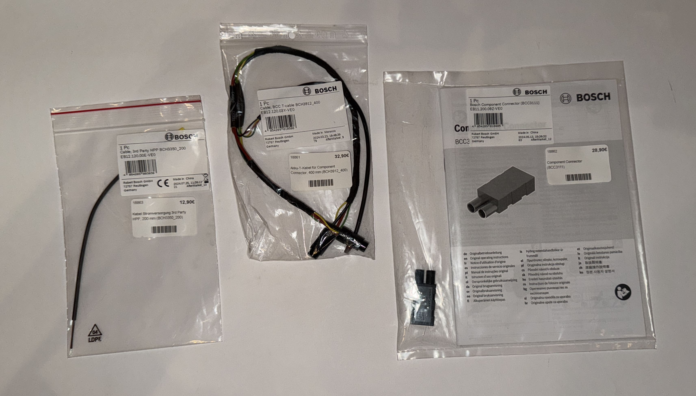

# Tracker with Bosch-SX
Implement a Teltonika Tracker in an eBike with Bosch SX Motor

Du möchtest einen Tracker in ein eBike mit Bosch SX Antrieb einbauen? Aber <strong>nicht</strong> das Bosch ConnectModule?

Das Bosch ConnectModule ist eine nette Sache, aber wenn du ein IT-affiner Mensch bist und gerne Herr über deine Daten bist, dann denkst du über andere Lösungen nach.

Meine Wahl viel auf 

<ul class="wp-block-list"><!-- wp:list-item -->
<li>Traccar als Hosting Platform. Traccar ist ein quelloffenes und kostenloses Paket mit dem du deine Tracker und ihre Daten verwalten kannst. Traccar lässt sich hervorragend z.B. mittels eines Docker Containers auf einem Synology + Model oder auf kleinen Rechnern wie einem Raspberry Pi installieren. Traccar ist hier erhältlich: <a href="https://y.hs58.de/wu049" target="_blank" rel="noreferrer noopener">https://www.traccar.org/</a></li>

<li>Nachdem ich verschiedene Chinesische Trackermodelle getestet und verworfen habe, bin ich bei Teltonika gelandet. Das sind professionelle Tracker, ich selbst verwende zwischenzeitlich nur noch den FMM920. Der kostet kleines Geld, ist klein, excellent zu konfigurieren und erwies sich als robust. Verbaut habe ich diese im Auto, in verschiedenen Fahrrädern und Motorrädern. Informationen zum Tracker gibt es hier <a href="https://y.hs58.de/czbgl" target="_blank" rel="noreferrer noopener">https://teltonika-gps.com/</a>. Beziehen kann man ihn am einfachsten über eBay.</li>

<li>SIM Card: Nachdem ich längere Zeit mit Aldi Talk gearbeitet hatte, ist meine Wahl zwischenzeitlich 1NCE. Dort bekommst du reine IoT (Internet of Things) Karten, das Datenvolumen ist bei weitem ausreichend. Zu beziehen hier: <a href="https://y.hs58.de/jdhx2">https://y.hs58.de/jdhx2</a>. Einziger Haken: Man muss eine Umsatzsteuer ID nachweisen, die Karten werden nicht an Privatpersonen verkauft. Aber vielleicht hast du ja eine Umsatzsteuer Id für deine Solaranlage? 
Eine Idee zum Datenverbauch: 4000km Strecke, alle 70m ein Punkt der nach Hause geschickt wird ergaben bei mir rund 5 MB Datenverbrauch. Bei 50m/Punkt ergaben sich rund 8 MB. 
Das sind so geringe Datenmengen, dass ich, obwohl nur Aldi Prepaidvertrag, auf Motorradtreisen den Tracker in Ländern wie Albanien (Länderzone 5) durchlaufen ließ.  
Bei 1NCE sind die Balkanstaaten im Vertrag inkludiert. 
</li>
</ul>

Auf die Installation von Traccar werde ich in diesem Artikel nicht eingehen. Für die Installation in einem Synology Docker Container habe ich einen Artikel geschrieben, den du hier findest: <a href="https://motorradtouren.de/coding-stuff/traccar/synology-docker-install-traccar-server/">https://y.hs58.de/5pcho</a>

Da der SX Antrieb im Gegensatz zum CX Antrieb keinen Hilfsausgang mehr hat, benötigt man ein paar Teile: 

<ul class="wp-block-list">
<li>1 Bosch Component Connector 12V BCC3111  Component ID: EB11.200.09Z-VE0</li>
<li>1 Kabel BCC T-cable BCH_3912_400  Component ID: EB12.120.03Y-VE0</li>
<li>1 Kabel HPP BCH3350_200 Component ID: EB12.120.00E-VE0</li>
</ul>

Diese Kombination stellt einen High Power Component Port (HPP) zur Verfügung der für verschiedene Anwendungen zum Einsatz kommt, beispielsweise dem Bosch eBike ABS, eShift Komponenten oder eben für unseren Tracker.

Der Zusammenbau des Kabels ist in der Anleitung des Bosch Component Connector beschrieben und durch die farbliche Kodierung simpel.

Wie geht es nun weiter?

<ul>
<li>Setzte die SIM Card in den Tracker und konfiguriere diesen. Vergesse nicht Bluetooth anzumachen, du kannst später nur noch so auf den Tracker zugreifen.</li>
<li>Bei meinem Cube ist der Akku fest verbaut. Um diesen auszubauen musst du den Motor ausbauen. Das ist aber kein Hexenwerk: 
<ul>
<li>Kette vom Blatt nehmen.</li>
<li>Motorschutz mit einer Schraube abbauen. </li>
<li>Die beiden Halteschrauben vom Motor lösen und die Achsen entfernen. Bei mir hat es sich bewährt den Motor etwas zu unterlegen, so verhindert man dass beim absenken zu viel Zug auf die eingesteckten Kabel kommt.</li>
</ul>
 </li>
</ul>

