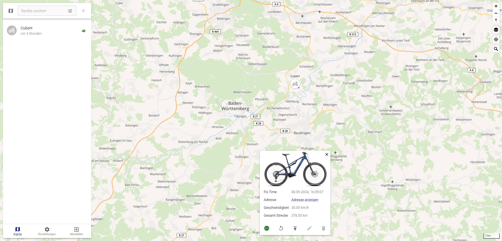

# Installing a Teltonika tracker in an eBike with a Bosch SX motor

Du möchtest einen Tracker in ein eBike mit Bosch SX Antrieb einbauen? Aber <strong>nicht</strong> das Bosch ConnectModule?

Das Bosch ConnectModule ist eine nette Sache, aber wenn du ein IT-affiner Mensch bist und gerne Herr über deine Daten bist, dann denkst du über andere Lösungen nach.

Meine Wahl fiel auf 

<ul class="wp-block-list"><!-- wp:list-item -->
<li>Traccar als Hosting Platform. Traccar ist ein quelloffenes und kostenloses Paket mit dem du deine Tracker und ihre Daten verwalten kannst. Traccar lässt sich hervorragend z.B. mittels eines Docker Containers auf einem Synology "Plus" Model oder auf kleinen Rechnern wie einem Raspberry Pi installieren. Traccar ist hier erhältlich: <a href="https://y.hs58.de/wu049" target="_blank" rel="noreferrer noopener">https://www.traccar.org/</a></li>

<li>Nachdem ich verschiedene Chinesische Trackermodelle getestet und verworfen habe, bin ich bei Teltonika gelandet. Das sind professionelle Tracker, ich selbst verwende zwischenzeitlich nur noch den FMM920. Der ist günstig, ist klein, excellent zu konfigurieren und erwies sich als robust. Verbaut habe ich diese im Auto, in verschiedenen Fahrrädern und Motorrädern. Informationen zum Tracker gibt es hier <a href="https://y.hs58.de/czbgl" target="_blank" rel="noreferrer noopener">https://teltonika-gps.com/</a>. Beziehen kann man ihn am einfachsten über eBay.</li>

<li>SIM Card: Nachdem ich längere Zeit mit Aldi Talk gearbeitet hatte, ist meine Wahl zwischenzeitlich <strong>1NCE</strong>. Dort bekommst du reine IoT (Internet of Things) Karten, das Datenvolumen ist bei weitem ausreichend. Zu beziehen hier: <a href="https://y.hs58.de/jdhx2">https://y.hs58.de/jdhx2</a>. Einziger Haken: Man muss eine Umsatzsteuer ID nachweisen, die Karten werden nicht an Privatpersonen verkauft. Aber vielleicht hast du ja eine Umsatzsteuer Id für deine Solaranlage? 
Eine Idee zum Datenverbauch: 
<ol>
<li>4000km Strecke, alle 70m ein Punkt der nach Hause geschickt wird ergaben bei mir rund 5 MB Datenverbrauch.</li>
<li>Bei 50m/Punkt und gleicher Streckenlänge ergaben sich rund 8 MB. </li>
</ol>
Das sind so geringe Datenmengen, dass ich, obwohl nur Aldi Prepaidvertrag, auf Motorradtreisen den Tracker in Ländern wie Albanien (Länderzone 5) durchlaufen ließ.  
Bei 1NCE sind die Balkanstaaten im Vertrag inkludiert. 
</li>
</ul>

Auf die Installation von Traccar werde ich in diesem Artikel nicht eingehen. Für die Installation in einem Synology Docker Container habe ich einen Artikel geschrieben, den du hier findest: <a href="https://motorradtouren.de/coding-stuff/traccar/synology-docker-install-traccar-server/">https://y.hs58.de/5pcho</a>

Da der SX Antrieb im Gegensatz zum CX Antrieb keinen Hilfsausgang hat, benötigt man ein paar Teile: 

<ul class="wp-block-list">
<li>1 Bosch Component Connector 12V BCC3111  Component ID: EB11.200.09Z-VE0</li>
<li>1 Kabel BCC T-cable BCH_3912_400  Component ID: EB12.120.03Y-VE0</li>
<li>1 Kabel HPP BCH3350_200 Component ID: EB12.120.00E-VE0</li>
</ul>

Diese Kombination stellt einen High Power Component Port (HPP) zur Verfügung der für verschiedene Anwendungen zum Einsatz kommt, beispielsweise dem Bosch eBike ABS, eShift Komponenten oder eben für unseren Tracker.

Der Zusammenbau des Kabels ist in der Anleitung des Bosch Component Connector beschrieben und durch die farbliche Kodierung simpel.

Wie geht es nun weiter?

<ul>
<li>Setzte die SIM Card in den Tracker und konfiguriere diesen. Vergesse nicht Bluetooth anzumachen, du kannst später nur noch so auf den Tracker zugreifen.</li>
<li>Teste die Funktionalität des Trackers! </li>

<li>Da der Tracker oberhalb des Akkus verbaut werden soll, muss der Akku entfernt werden. Bei meinem Cube ist der Akku fest verbaut. Um diesen zu entnehmen muss der Motor ausbaut werden. Das ist aber kein Hexenwerk: 
<ul>
<li>Kette vom Blatt nehmen.</li>
<li>Motorschutz mit einer Schraube abbauen. </li>
<li>Die beiden Halteschrauben vom Motor lösen und die Achsen entfernen. Bei mir hat es sich bewährt den Motor zu unterlegen, damit beim Absenken nicht zu viel Zug auf die angeschlossenen Kabel ausgeübt wird.</li>
</ul>
<li>Zwei Schrauben lösen die den Akku halten.</li>
<li>Den Akku aus dem Rahmen entnehmen, dabei die Powerkabel für den Ladeport und den Motor entfernen. </li>
<li>Das Kabel zwischen Akku und Motor entfernen und gegen unser neu zusammengestöpsteltes Kabel ersetzen. </li>
<li>Teste nun, ob auch Spannung am Ausgang anliegt sobald der Motor eingeschaltet wurde.</li>

<li>Verlöte die Kabel des Trackers mit denen des HPP Kabels. Ziehe am besten Schrumpfschlauch zur Isolation über die Lötstellen.</li>

<li>Um den Tracker vor Erschütterungen zu schützen, habe ich ihn in Transportfolie verpackt. Um ihn möglichst weit von den bereits verlegten Kabeln entfernt zu halten (gegen mögliche Interferenzen des GSM-Moduls mit den Bosch-Kabeln), habe ich noch eine zusätzliche Rolle als Abstandshalter eingepackt. </li>

<li>Der Tracker wird in den Rahmen eingeschoben und mit dem Akku im Rahmen nach oben gedrückt. </li>

<li>Akku festschrauben. Stelle sicher, dass zuvor das Ladeport- und Motorkabel eingesteckt ist.   </li>

<li>Der Bosch Component Connector 12V wird nun gegen Klappern im Rahmen gesichert.</li>

<li>Den BCC 12V verbaute ich im Sitzrohr. Dort kann auch das überschüssige Kabel untergebracht werden.
 
So sieht am Ende der Blick von unten in den Motorschacht aus:
</li>

<li>Abschließen den Motor wieder einbauen, das Displaykabel nicht vergessen einzustecken, den Motorschutz festschrauben und die Kette aufs Blatt legen.  </li>
 </li>

<li>Ein kurzer Blick auf das Traccar Portal zeigt, dass der Tracker funktioniert:  </li>

</ul>

<h1>Ein Nachtrag</h1>

An der Stelle wo das Unterrohr, Steuerrohr und Oberrohr zusammentreffen sind die Carbonteile auf ein Stahlformblech laminiert. Bei meinem ersten Einbau ging der Tracker nicht, da die GPS und GPRS Komponenten des Trackers bereits unter das Stahlblech gerutscht waren und somit von diesem abgeschirmt wurden.

Die Lösung war bei mir, den Tracker 180 Grad verdreht einzubauen. Fazit: Bevor alles zusammengebaut wird, genau prüfen ob der Tracker noch Verbindung hat.  Durch die Bluetoothverbindung kannst du das Verhalten sehr gut Live verfolgen.

